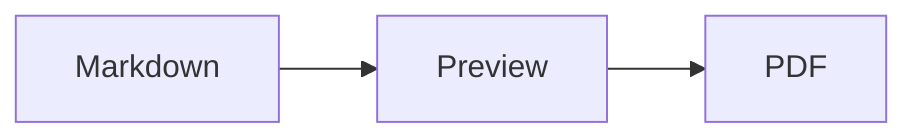

# Markdown LaTeX PDF Studio

A browser-based Markdown editor for writing documents with LaTeX equations, Mermaid diagrams, syntax-highlighted code, and print-ready page layouts. It runs as a small static web app—no build step or package installation is required.

**[Open the live app](https://mdlatexmermaid2pdf.netlify.app/)**

## Features

- Live Markdown preview with tables, task lists, footnotes, definition lists, and typographic extensions
- Inline and display LaTeX rendered with MathJax
- Mermaid diagrams rendered directly in the preview
- Language-aware syntax highlighting for fenced code blocks
- Automatic table of contents with `[[toc]]`
- A4, Letter, and Legal page layouts with configurable margins
- Optional Paged.js smart pagination for book-style page breaking
- Paper, Scholar, and Technical preview themes, plus an independent dark palette
- Browser printing and PDF export
- Markdown and rendered HTML downloads
- Markdown file import
- Document templates, formatting shortcuts, line numbers, and editor wrapping
- Word, character, heading, and estimated reading-time statistics
- Responsive, collapsible, and resizable panes
- Automatic local saving of the document and UI preferences
- Warning before closing the tab when Markdown changes are unsaved

## Getting started

Clone or download the project, then serve its directory with any static web server. For example, with Python:

```bash
python3 -m http.server 8000
```

Open <http://localhost:8000> in a modern browser.

You can also open `index.html` directly, although a local server gives more consistent browser behavior. An internet connection is needed on first load because the rendering libraries are loaded from jsDelivr.

## Usage

1. Write or paste Markdown in the center editor.
2. Choose a theme, page size, margins, and wrapping options in the Format panel.
3. Check the rendered result in the Preview panel.
4. Select **Print**, then choose **Save as PDF** in the browser print dialog.

The document title is derived from the first Markdown heading unless you enter a custom title. It is also used as the downloaded filename.

Use `**bold**`, `_italic_`, and `++underline++` for inline text formatting.

### Themes

- **Paper** is the default general-purpose print layout.
- **Scholar** uses academic document styling, including serif typography, restrained headings, paragraph indentation, lighter table rules, and diagram-safe Mermaid rendering.
- **Technical** uses a sans-serif layout for code-heavy or reference-style documents.
- **Dark palette** is separate from the theme selector and can be combined with any theme.

### LaTeX

Use dollar delimiters for inline and display math:

```markdown
Euler's identity is $e^{i\pi} + 1 = 0$.

$$
\int_{-\infty}^{\infty} e^{-x^2}\,dx = \sqrt{\pi}
$$
```

MathJax includes several additional TeX packages, including `ams`, `mathtools`, `mhchem`, `physics`, `braket`, `cancel`, and `upgreek`.

### Mermaid diagrams

Use a fenced code block with the `mermaid` language:

````markdown

````

Mermaid diagrams are rendered as SVG in the preview and print output. If Mermaid cannot load, the original diagram source remains visible as a fallback.

### Table of contents

Place the following marker where the generated table of contents should appear:

```markdown
[[toc]]
```

Headings from levels 1 through 4 are included.

### Manual page breaks

Insert this HTML between sections to start the following content on a new printed page:

```html
<div class="page-break"></div>
```

## Files and exports

- **Open** imports `.md`, `.markdown`, or `.txt` files.
- **Save MD** downloads the current Markdown source.
- **Save HTML** downloads the currently rendered article. Keep `styles.css` beside the exported file so its document styles can load.
- **Print** opens the browser print dialog, where the document can be printed or saved as a PDF.

The current document, settings, pane visibility, and pane widths are stored in the browser's `localStorage`. Clearing site data resets them. Imported files are read locally in the browser and are not uploaded by this application.

## Project structure

```text
.
├── index.html   # Application shell and CDN dependencies
├── app.js       # Editor, rendering, persistence, and export logic
└── styles.css   # Application, preview, responsive, and print styles
```

## Rendering libraries

The app loads these libraries from jsDelivr:

- markdown-it and its syntax plugins
- DOMPurify
- Highlight.js
- Mermaid
- MathJax
- Paged.js 0.4.3

If a CDN dependency is unavailable, the app provides basic fallback rendering for Markdown, math, code, and diagrams. Smart pagination requires Paged.js; native browser printing remains available when the setting is disabled.

## Browser support

Use a current version of Chrome, Edge, Firefox, or Safari. PDF output is produced by the browser, so pagination and print options can vary slightly between browsers. For predictable output, enable background graphics in the print dialog when the selected theme uses them.

## Development

There is no compilation step. Edit `index.html`, `app.js`, or `styles.css`, refresh the browser, and inspect the browser console for rendering or dependency compatibility messages.
